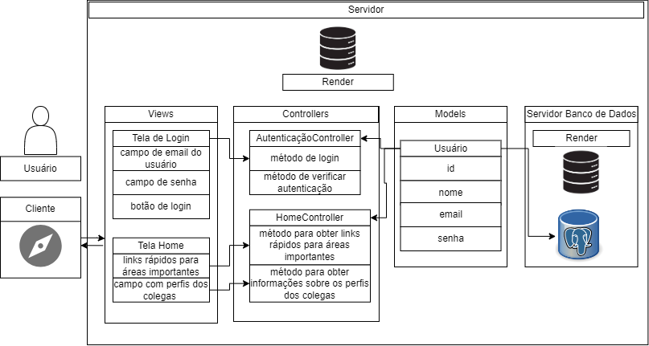

A análise da arquitetura do projeto Zuyd Connections representam uma atividade ponderada de programação realizada durante a Semana 2 do curso.

Ao delimitar o escopo da atividade, nos concentramo nas funcionalidades essenciais do projeto, destacando elementos-chave como a tela de login e a home para a compreensão da arquitetura MVC, da ferramenta de diagramação utilizada e dos principais componentes do sistema.

# Nome do Projeto: Zuyd Connections
## Descrição:
Zuyd Connections é um sistema web projetado para otimizar a colaboração e a gestão de tarefas em ambientes de equipe. Oferecendo uma plataforma intuitiva e eficiente, ele facilita a comunicação entre membros da equipe, o acompanhamento de tarefas e a avaliação do desempenho.

## Arquitetura: MVC (Model-View-Controller)
A arquitetura MVC foi escolhida para garantir uma estrutura organizada e modular ao projeto. Ela permite a separação clara de responsabilidades entre os modelos de dados, as views de apresentação e os controladores de lógica de negócios. Isso não só simplifica o desenvolvimento, mas também facilita a manutenção e a escalabilidade futura da aplicação.

## Ferramenta de Diagramação: draw.io
O uso da ferramenta draw.io proporcionou uma visualização clara e concisa da arquitetura do projeto, permitindo uma comunicação eficaz entre os membros da equipe e facilitando o planejamento e a documentação do sistema.

### Modelos (Models):
O modelo de dados do Zuyd Connections é centrado no conceito de Usuário, que encapsula informações essenciais sobre os membros da plataforma, como identificação, nome, e-mail e senha. Este modelo serve como base para a gestão de contas de usuário e para a atribuição de tarefas e avaliações.

### Controladores (Controllers):
Os controladores desempenham um papel crucial na aplicação, fornecendo a camada de lógica de negócios que coordena as interações do usuário. O AutenticaçãoController gerencia a autenticação dos usuários, enquanto o HomeController é responsável por fornecer uma interface intuitiva para a navegação e a visualização das funcionalidades principais da aplicação.

### Views (Views):
As views são responsáveis por apresentar os dados de forma compreensível e interativa aos usuários. A Tela de Login oferece uma entrada segura e acessível ao sistema, enquanto a Tela Home proporciona uma visão geral das capacidades da plataforma, facilitando a navegação e o acesso rápido às áreas relevantes.

### Infraestrutura:
A escolha de um banco de dados relacional como base de dados para o Zuyd Connections foi feita com o intuito de garantir segurança, confiabilidade e escalabilidade. A comunicação entre a aplicação e o banco de dados é intermediada pelo modelo no padrão MVC, assegurando uma manipulação eficiente e consistente dos dados.

### Implicações da Arquitetura:
A arquitetura MVC oferece uma série de benefícios para o desenvolvimento e a manutenção do Zuyd Connections. Ao separar claramente as preocupações de apresentação, lógica de negócios e manipulação de dados, ela facilita a identificação e a resolução de problemas, além de promover a reutilização de código e a colaboração entre desenvolvedores. O uso de um banco de dados relacional contribui para a escalabilidade da aplicação, permitindo que ela cresça de forma eficiente com o aumento do número de usuários. Essas escolhas arquiteturais visam garantir a qualidade, a robustez e a adaptabilidade do Zuyd Connections em um ambiente dinâmico de equipe.

Em conclusão, a elaboração da arquitetura do projeto Zuyd Connections proporcionou uma visão abrangente sobre a arquitetura MVC, ferramentas de diagramação e aspectos cruciais no desenvolvimento de uma aplicação web. É importante ressaltar que, embora tenhamos nos concentrado nas funcionalidades essenciais do projeto, nem todas as características foram representadas no diagrama, conforme as instruções que delimitaram o escopo da atividade.
